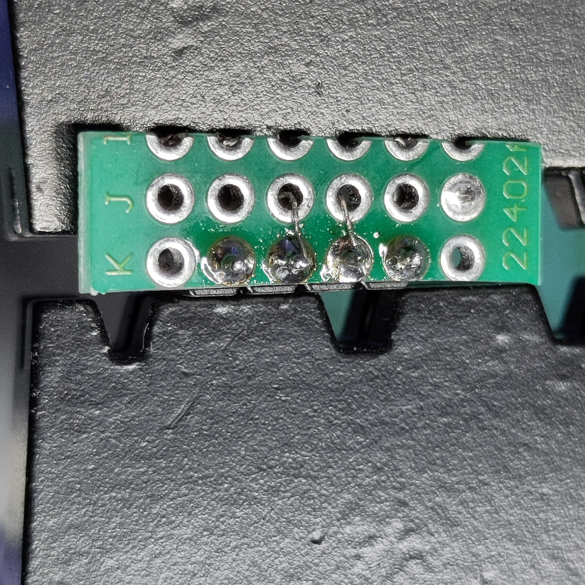
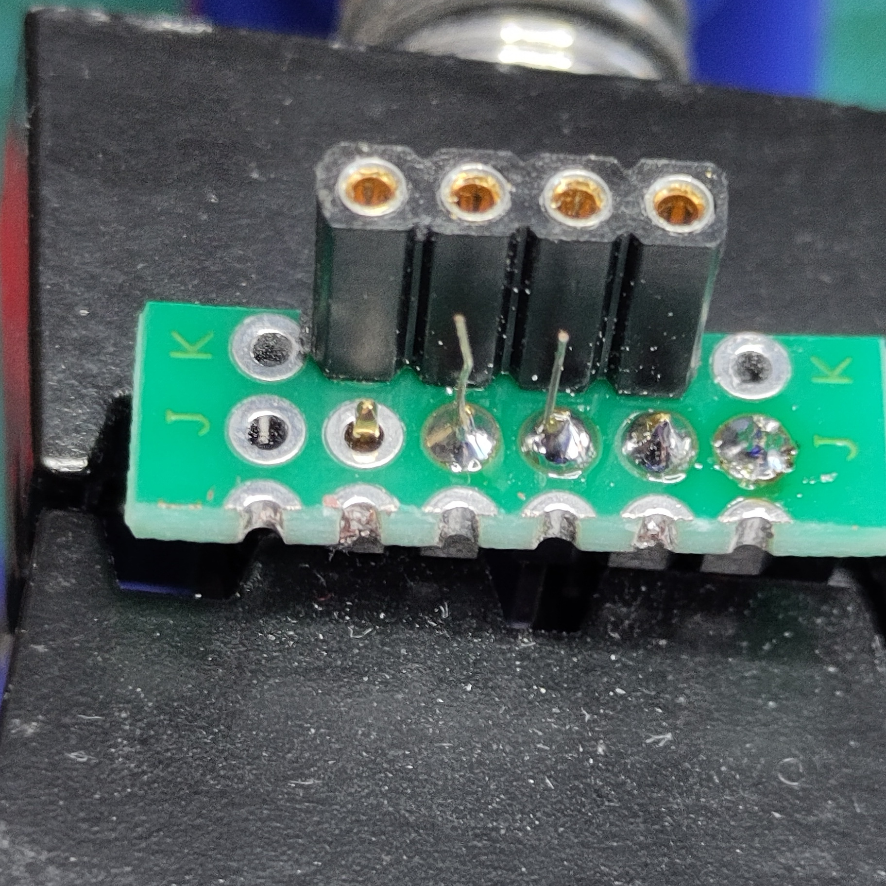
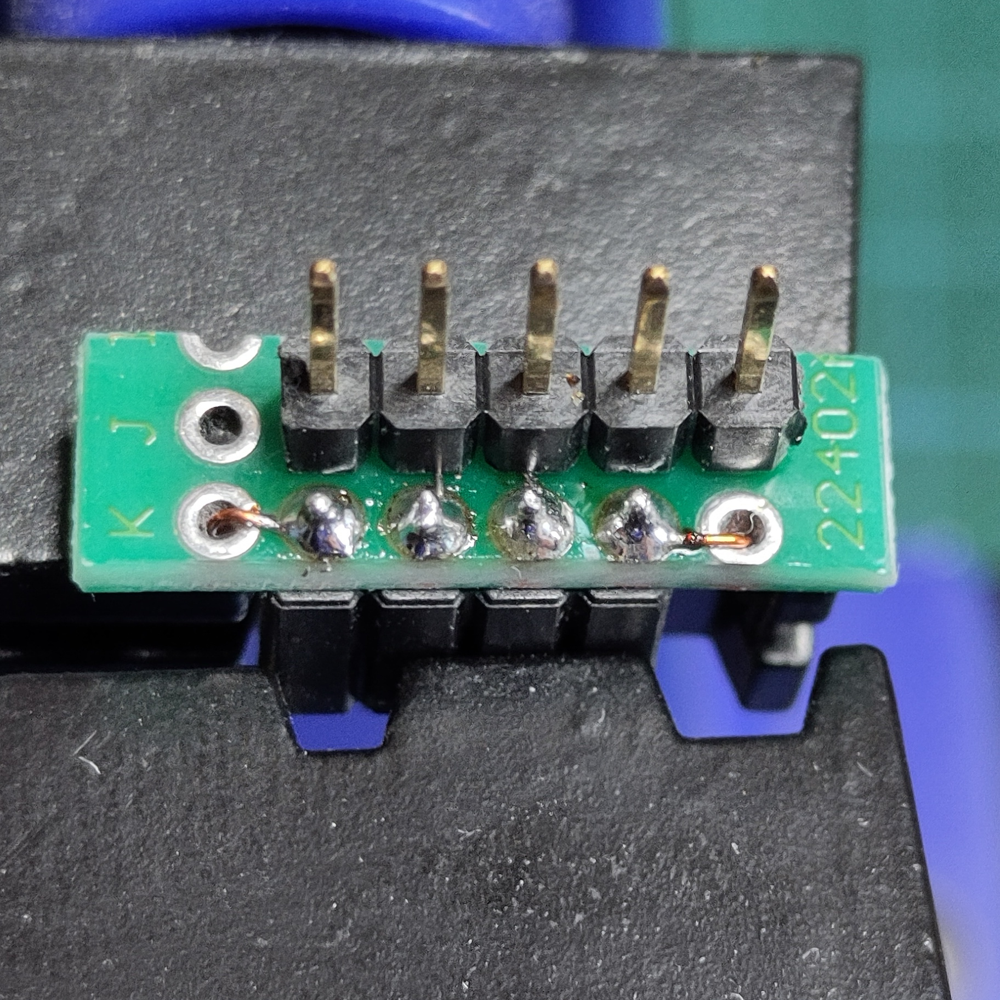
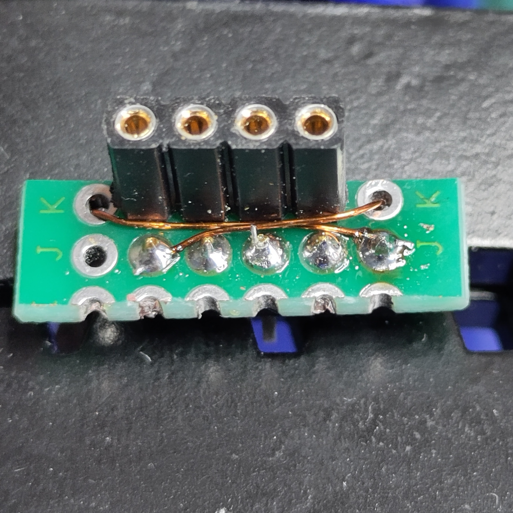

# Adapter for DS3231 RTC Module (for Raspberry Pi) to LoRaWAN_Node

This adapter allows to connect the [DS3231 RTC Module for Raspberry Pi](https://www.berrybase.de/en/ds3231-real-time-clock-module-for-raspberry-pi) to LoRaWAN_Node.


                                                                                                                                                                  
The RTC module is connected to the LoRaWAN_Node's connector J3 (I2C Bus).

**Wiring Scheme:**

```ascii
DS3231 Module                  
(Top View; IC)                 
 ┌─────────┐                   
 │ GND   5 ├─────┐ LoRaWAN Node (J3)
 │         │     │  ┌───────┐  
 │ NC    4 │  ┌──┼──┤ 4 3V3 │  
 │         │  │  │  │       │  
 │ SCL   3 ├──┼──┼──┤ 3 SCL │  
 │         │  │  │  │       │  
 │ SDA   2 ├──┼──┼──┤ 2 SDA │  
 │         │  │  │  │       │  
 │ 3V3   1 ├──┘  └──┤ 1 GND │  
 └─────────┘        └───────┘  

```

1. 4-Position Socket Header and Vias for SCL and SDA - Soldering

   

2. 4-Position Socket Header and Vias for SCL and SDA - Mounting Position

   

3. 5-Position Pin Header - Mounting Position

   

4. 5-Position Pin Header - 3V3 and GND Wiring

   
