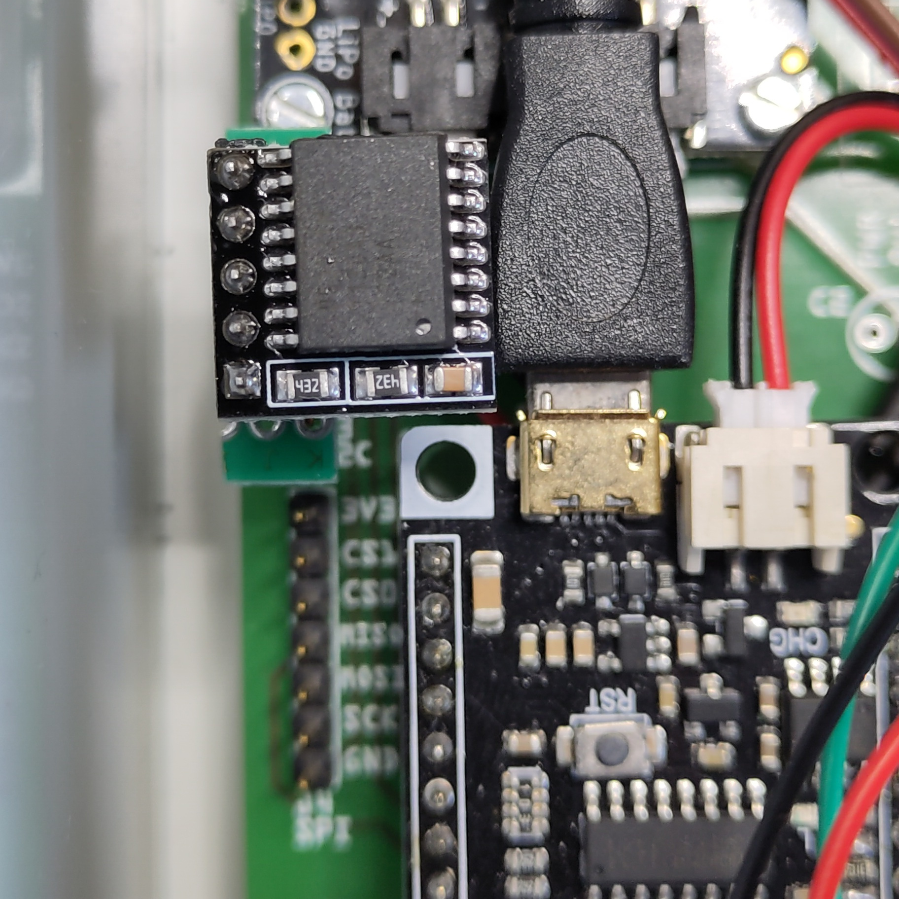

# Adapter for DS3231 RTC Module (for Raspberry Pi) to LoRaWAN_Node

This adapter allows to connect the [DS3231 RTC Module for Raspberry Pi to LoRaWAN_Node](https://www.berrybase.de/en/ds3231-real-time-clock-module-for-raspberry-pi).

                                                                                                                                                                  
